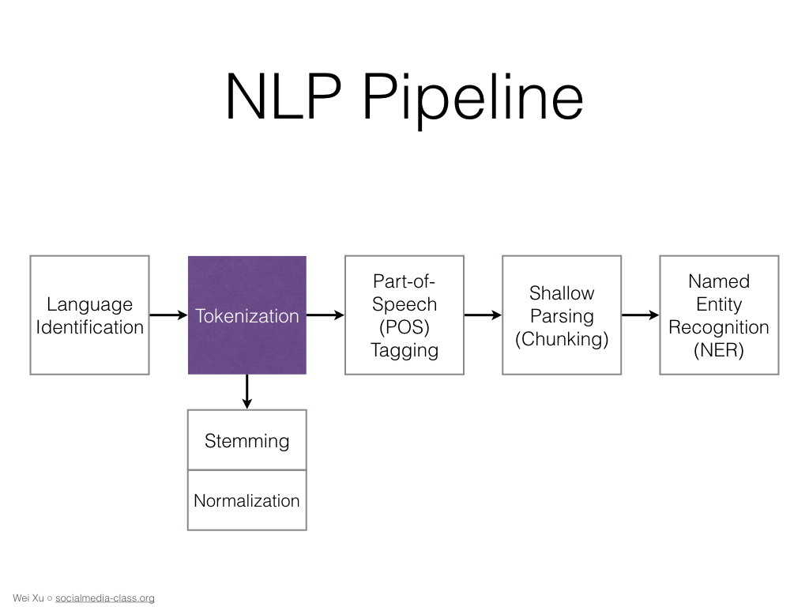

A Beginner's Guide - Python, NLP, and Twitter API
=============================================================

**by [Wei Xu](https://cocoxu.github.io/)** <a class="twitter-follow-button" data-show-count="false" href="https://twitter.com/cocoweixu">Follow @cocoweixu</a>  **&nbsp;&nbsp;(Ohio State University)**

The following material is created for students with some or no programming experience. The current version consists of three mini-lectures, accompanied with [sample code in Google Colaboratory](https://colab.research.google.com/drive/14WRK_N_Jvhsx4KyOHfFXuG8n3J4CFZcX) for students to run in web browsers with no setup or installing any software. 

Upcoming  
: 
- (tentative) April 4th, 2020. [ACM-W Code I/O for students ages 10-15 at Ohio State University](https://acmwosu.github.io/codeio.html)
- March 23rd, 2019. [Ohio High School Hackathon](https://hack.osu.edu/hs/2019/) [download [slides](./slides_highschool/45min_python_twitter_nlp.pdf)]. 

(Please feel free to use any of these material and let us know!)

   <table class="table table-striped">

     <tbody>
       <tr>
         <td><b>Part 1</b></td>
         <td><a href="./slides_highschool/15min_intro_python.pdf"><b>Introduction to Python</b></a>
          
          
          &nbsp;
          &nbsp; 
         
         </td>
       </tr>
       <tr>
         <td></td>
         <td></td>
       </tr>
       <tr>
         <td><b>Part 2</b></td>
         <td><a href="./slides_highschool/15min_intro_nlp.pdf"><b>Introduction to Natural Language Processing (NLP)</b></a>
          
          
          &nbsp;
          &nbsp; 
         
         </td>
       </tr>
       <tr>
         <td></td>
         <td></td>
       </tr>
       <tr>
         <td><b>Part 3</b></td>
         <td><a href="./slides_highschool/15min_intro_twitter_api.pdf"><b>Introduction to Twitter API</b></a>
          
          
          &nbsp;
          &nbsp; 
         
         </td>
       </tr>
     </tbody>
   </table>
  
 

 

